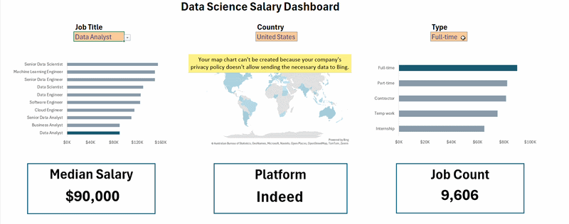

# 📊 Excel Data Analytics Portfolio  

This repository showcases Excel-based data analytics projects focused on transforming raw datasets into structured insights and business-ready dashboards using Excel, Power Query, and data modeling techniques.

---

## 🛠 Tools & Skills Used

- Microsoft Excel
- Power Query
- Pivot Tables
- Data Cleaning
- Data Validation
- Dashboard Design
- Basic DAX
- Analytical Thinking

---

## 📁 Projects

### 1️⃣ [Salary Dashboard](Salary_dashboard)

**Objective:**  
Analyze salary trends across job roles, locations, and skill combinations.

**Key Insights:**
- Roles requiring multiple technical skills (Python + SQL + Cloud) tend to offer higher compensation.
- Location significantly impacts salary distribution.
- Specialized roles command premium pay compared to generalist roles.

**Skills Applied:**
- Pivot Tables
- Charts & Visualizations
- Data Validation
- Dashboard Structuring

---

### 2️⃣ [Job Market Analysis](Job_Market_Analysis)

**Objective:**  
Identify the most in-demand skills in the data job market using real-world job listing data.

**Key Insights:**
- SQL and Python consistently appear across high-paying roles.
- Cloud-related skills are increasingly linked with higher salaries.
- Certain roles demand hybrid skill sets.

**Skills Applied:**
- Power Query (Data Cleaning & Transformation)
- Aggregation & Grouping
- Excel Formulas
- Insight Generation

---

## 🎯 Project Goal

The goal of these projects is to demonstrate:

- Practical business-focused data analysis
- Clear dashboard communication
- Structured problem-solving
- Readiness for entry-level Data Analyst roles

---

## 📌 Future Improvements

- Adding Power BI dashboards
- Advanced SQL case studies
- More business decision-oriented analysis

---

Thank you for visiting my portfolio.